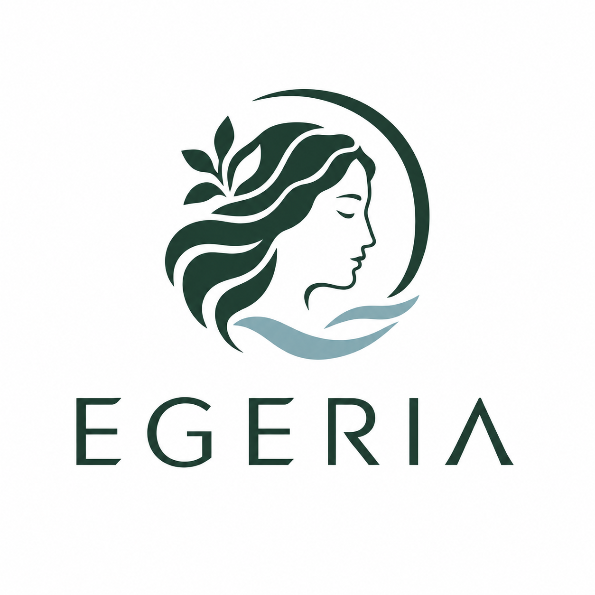

[English](README.md) · **Italiano**

# Egeria

<p align="center"></p>

<p align="center">[](https://github.com/kuduk/egeria/actions/workflows/tests.yml)</p>

> Il nome viene dalla ninfa Egeria, consigliera del re Numa Pompilio: un consigliere piccolo e rapido che dà il suo parere, e dice quanto ne è sicuro, a chi decide davvero (un LLM grande, un agente, una persona). Fino al 28/09/2026 il progetto si chiamava **semLMM**: pacchetto, comando e cartella sono stati rinominati in `egeria`.

Progetto per costruire un **modello decisionale semantico "System 1"** sulla famiglia **Qwen3.5**, sul modello di Jev (TypeSafe), Laya (Convai) e SemIf.

Un modello di questo tipo:
- riceve uno **stato**, in testo o JSON;
- riceve delle **domande tipizzate** (`noul` sì/no, `choice`, `score`);
- restituisce in un solo forward pass **probabilità calibrate** sulle opzioni dichiarate, senza generare testo.

## Stato del progetto

| Fase | Stato |
|---|---|
| Ricerca sullo stato dell'arte | Completata (settembre 2026) |
| **F0** – baseline zero-shot (readout dei logit delle lettere, stile SemIf) + diagnostica della profondità dinamica per asserzione | Completata: harness pronto; zero-shot i modelli piccoli non battono la Prior; profondità dinamica con 27–36% di risparmio potenziale |
| Stato con immagini (multimodale) | Integrato nell'API (`decide`) |
| Primitive zero-shot `number` e `open`, più il vettore dello stato (`/v1/embed`) | Implementate e verificate (`multi` e `surprise` tolte: non superavano la prova) |
| Memoria esterna (ricordi simili + voto dei ricordi in output, `memory.recall`), anche con immagini | Implementata: voto dei ricordi 0.56 contro 0.47 del modello zero-shot; con le foto 5/6. `known` verificata e non tenuta |
| Interfaccia web generica (`egeria serve`): chiedi su testo, immagini o dal vivo; storico; ricordi | Implementata e collaudata nel browser |
| Modello separato dal server web (`egeria model-server`, API senza stato, token opzionale) | Implementato e collaudato |
| Semplificazione: tolti profondità dinamica, `rank`, la domanda `recall`, `embed` dentro la richiesta, `inject` | Completata il 29/09/2026 |
| **F0.5** – misurare e accelerare senza training: riuso dello stato, controlli senza etichette, calibrazione con spostamento, set di valutazione | In corso: riuso dello stato fatto (con le immagini fino all'80% di tempo in meno) |
| **F1** – primo LoRA su un compito con le immagini, in locale | Dopo F0.5 (roadmap in [02](documentazione/02-implicazioni-e-proposta.md) §6) |

## Avvio rapido

```bash
uv venv --python 3.12 .venv
uv pip install --python .venv/bin/python -e ".[model,eval,dev]"   # + ",vision" per gli stati con immagini
.venv/bin/egeria info
.venv/bin/egeria decide --model Qwen/Qwen3.5-2B-Base --permutations 2 examples/ticket_it.json
.venv/bin/pytest -q
```

I test girano anche su GitHub Actions ([.github/workflows/tests.yml](.github/workflows/tests.yml)) a ogni pull request verso `main` e `develop` e dopo ogni merge, senza torch né modello; i test d'integrazione con il modello vero si lanciano in locale con `EGERIA_TEST_MODEL=Qwen/Qwen3.5-0.8B-Base .venv/bin/pytest -q -m model`.

La richiesta ha lo stesso formato di una `POST /v1/systemone` di Jev (`state` + `questions`), e così la risposta. Esempi in [examples/](examples/).

**Soglia di confidenza per asserzione.** Estensione opzionale: `min_confidence` per domanda o globale nella richiesta; il valore locale sovrascrive il globale. Sotto la soglia la risposta ha `status: uncertain`, altrimenti `decided`. Fino al 29/09/2026 la stessa soglia faceva anche uscire il modello prima (profondità dinamica): tolta, perché zero-shot il guadagno reale era dello 0.5–4% ([documentazione/03-baseline-f0.md](documentazione/03-baseline-f0.md) §6).

Per i kernel veloci dei layer Gated DeltaNet, la quantizzazione a 4 bit e la valutazione su typed-decisions vedi [documentazione/03-baseline-f0.md](documentazione/03-baseline-f0.md).

## Interfaccia web

Il modello e l'interfaccia sono due server separati; si avviano in due terminali:

```bash
uv pip install --python .venv/bin/python -e ".[model,eval,vision,server]"
.venv/bin/egeria model-server --model Qwen/Qwen3.5-2B-Base    # il modello sulla GPU, porta 8100
.venv/bin/egeria serve --model-url http://127.0.0.1:8100      # l'interfaccia, porta 8000 (senza torch)
```

Il server del modello non ha stato: risponde a `/v1/systemone` e `/v1/embed`. Storico, immagini caricate e ricordi stanno nel server web. Si può quindi cambiare modello, o farlo girare su un'altra macchina, senza toccare i dati.

Poi apri **http://localhost:8000/** nel browser (anche da Windows, se il server gira in WSL).
- A sinistra scrivi un testo, aggiungi immagini o accendi la telecamera.
- A destra scrivi le domande e scegli il tipo di risposta: Sì/No, una tra più opzioni, una scala, un numero, una parola.
- Premi *Chiedi*, correggi se serve, *Salva nei ricordi*.

Dettagli in [documentazione/07-interfaccia.md](documentazione/07-interfaccia.md).

## Documentazione

| Documento | Contenuto |
|---|---|
| [documentazione/01-stato-dell-arte.md](documentazione/01-stato-dell-arte.md) | Survey: Jev, Laya, SemIf, repliche aperte su Qwen, benchmark, Qwen 3.8, tecniche di readout, calibrazione, paradigmi JEPA/LCM |
| [documentazione/02-implicazioni-e-proposta.md](documentazione/02-implicazioni-e-proposta.md) | Decisioni prese, architettura proposta, training, valutazione, limiti attuali, roadmap, decisioni aperte |
| [documentazione/03-baseline-f0.md](documentazione/03-baseline-f0.md) | Baseline F0: codice, installazione (anche kernel veloci), uso, insidie verificate, risultati |
| [documentazione/04-stato-con-immagini.md](documentazione/04-stato-con-immagini.md) | Stato con immagini: formato JSON, esempi, risultati (26/26 sui 2B), verso il tempo reale |
| [documentazione/05-primitive-di-lettura.md](documentazione/05-primitive-di-lettura.md) | Primitive oltre noul/choice/score: verifica, **esempi d'uso** (number, open, vettore dello stato) e confronto con Jev e Laya |
| [documentazione/06-memoria.md](documentazione/06-memoria.md) | Memoria esterna: ricordi richiamati per somiglianza, voto dei ricordi, gestione dell'archivio |
| [documentazione/07-interfaccia.md](documentazione/07-interfaccia.md) | Interfaccia web: avvio, architettura (modello e server web separati, API del modello, token), pagina Chiedi, dal vivo, storico, ricordi, impostazioni, API, collaudo |
| [documentazione/08-riuso-dello-stato.md](documentazione/08-riuso-dello-stato.md) | Riuso dello stato: prefisso calcolato una volta per tutte le domande, verifica, misure, regola della modalità `auto` |
| [documentazione/fonti.md](documentazione/fonti.md) | Elenco delle fonti per area |

La documentazione è anche in inglese, in [documentazione/en/](documentazione/en/).

## Struttura

```
src/egeria/     pacchetto: schema, prompt, scorer, calibrazione, metriche, memoria, server, CLI
src/egeria/web/ interfaccia web (HTML/CSS/JS statici); img/logo.png è il logo, le icone si ricavano con scripts/genera_icone.py
scripts/        valutazioni (baseline.sh, run_all.sh, verifiche), collaudo dell'interfaccia, icone dal logo
tests/          test unitari (+ test d'integrazione col modello, opzionali)
runs/           output dei run (predizioni, temperature, report); non versionato
documentazione/ documentazione del progetto
```
